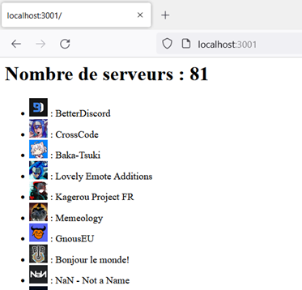
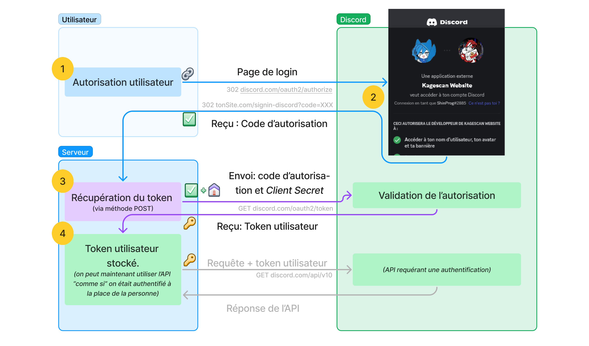

\hypersetup{colorlinks=true, allbordercolors={0 0 0}, pdfborderstyle={/S/U/W 1}}



# I. Cours

## 1) Les APIs et les tokens

Nous sommes dans l'ère du web 2.0, où nos applications sont toutes connectées
entre elles. Par exemple, vous avez probablement déjà utilisé une application
comme draw.io, qui est capable de sauvegarder ses dessins sur Google Drive. Ou
alors créer un compte OpenAI grâce à votre compte Microsoft.

Ces applications ont besoin d'utiliser une API. Et pour chaque action (ex :
sauvegarder un fichier sur votre cloud perso), **l'application aura besoin de se
faire passer pour vous**.

Plutôt que de stocker votre combinaison "utilisateur"/"mot de passe", ce qui est
vraiment risqué, nous avons besoin d'utiliser des tokens. Les tokens possèdent
également d'autres avantages, tel qu'accorder un ensemble limité de permissions
pour une application donnée. Eh oui, ce serait vachement dommage que votre appli
fidélité puisse accéder ou supprimer vos précieux fichiers stockés sur le Google
drive.

Mais vous allez me dire : "Comment on fait pour avoir le token de quelqu'un ?".
Eh bien, c'est là que le protocole OAuth entre en jeu.

## 2) Le protocole OAuth2

OAuth est un modèle standardisé
([RFC-6749](https://www.rfc-editor.org/rfc/rfc6749)) qui nous permet de
récupérer ce fameux token, avec l'accord explicite de l'utilisateur (via une
page de login). Il existe différents niveaux de sécurité, mais nous allons voir
le modèle traditionnel sur Discord.

Voici comment se déroule le processus :

1. L'utilisateur clique sur le bouton "Se connecter avec Discord" et accède à la
   page d'authentification de Discord
2. L'utilisateur accepte l'application et est redirigé sur l'application, avec
   un code d'autorisation
3. L'application envoie le code d'autorisation à Discord ainsi qu'une clé privée
   ("client secret"). Il reçoit en réponse le fameux token
4. L'application peut maintenant utiliser le token d'accès pour récupérer des
   informations sur l'utilisateur.



Chacune de ces étapes possède un avantage d'un point de vue sécurité :

1. L'utilisateur autorise explicitement l'application à accéder à ses données,
   via une page web contrôlée par le fournisseur.
2. Le code d'autorisation est temporaire et ne peut être utilisé qu'une seule
   fois; contrairement au véritable token. Et vous me direz "mais si celui-ci
   est intercepté ?"
3. Eh bien le _client secret_ empêchera l'usurpation d'un serveur (finalement,
   un moyen pour le serveur de lui aussi s'authentifier).
4. Seul le serveur reçoit le token d'accès, il devrait donc être stocké sur un
   endroit bien mieux sécurisé que sur le navigateur du client.

## 3) Création d'un serveur web et déploiement en edge functions

Il existe plusieurs serveurs web créés sur Deno. Nous avons vu la dernière fois
Aqua, qui est assez intuitif.

Ci-dessous un code boilerplate pour créer un serveur web avec aqua. En démarrant
le script, accordez l'autorisation du réseau avec le flag `--allow-net`.

```ts
import Aqua from "https://deno.land/x/aqua@v1.3.5/mod.ts";

const aqua = new Aqua(3001);
aqua.get("/", async (req) => {
  return `
      <p>Hello World</p>
      <pre>Query Params : : \n ${JSON.stringify(req.query)}</pre>
  `;
});

console.log("Serveur démarré sur http://localhost:3001");
```

Après avoir finalisé votre projet, vous pouvez l'envoyer sur une edge function
gratuitement avec [Deno Deploy](https://deno.com/deploy). Pour adapter votre
projet Aqua sur deno deploy, consultez la
[section dédiée sur leur github](https://github.com/grayliquid/aqua#using-deno-deploy)

## 4) Stocker des secrets

Nous l'avons vu tout à l'heure, notre serveur aura besoin d'un _client secret_,
stocké dans un endroit sûr. Pour cela, les développeurs utilisent souvent des
variables d'environnement, enregistrées dans un fichier `.env` (dotenv).

Pour lire un fichier .env, nous pouvons utiliser le module
[deno-dotenv](https://deno.land/x/dotenv). Pour utiliser ce module, vous devrez
autoriser les permissions `--allow-read` et `--allow-env`.

```ts
import { config } from "https://deno.land/x/dotenv/mod.ts";

// lis le .env et enregistrer les variables dans Deno.env
config({ export: true });

console.log("CLIENT_ID : ", Deno.env.get("CLIENT_ID"));
```

# II. Le projet à réaliser

Vous devrez créer une application permettant :

- D'afficher un bouton de connexion via discord (si l'utilisateur n'est pas
  connecté)
- Après connexion, afficher les informations sur ses serveurs

Une suite de sprints vous permettra de réaliser ce projet. Il n'est pas
obligatoire de les respecter à la lettre, bien que cela soit vivement conseillé.

Pour réaliser ce TP, vous aurez besoin (évidemment) d'un compte discord, ainsi
que de lire progressivement la documentation sur
[https://discord.com/developers/docs/topics/oauth2](https://discord.com/developers/docs/topics/oauth2)

\newpage

## Sprint 1 : Une page de login

1. Créez une application discord sur le
   [portail développeur](https://discord.com/developers/applications). Une fois
   la configuration faite, rendez-vous sur la section "Oauth2"
2. Copiez le client ID et le client secret dans un fichier de configuration, tel
   qu'un `.env`. Assurez-vous que les variables sont bien importées.
3. Créez une route `/signin-discord`, qui nous permettra de récupérer le code
   d'authentification. Pour le moment, elle doit afficher le code d'autorisation
   (contenu du QueryParam `code`). Testez.
4. Créez une page d'accueil sur `/`, qui contient un bouton pour se connecter à
   Discord.

   Pour créer le lien, vous avez la page "URL Generator" dans la section
   "Oauth2" de votre application. Les permissions nécessaires sont `identify` et
   `guilds`, tandis que le type d'authentification est `code`. Vous aurez
   également besoin de vous munir du client ID et de l'adresse de redirection
   (qui doit être correctement configurée).

## Sprint 2 : Obtenir le token grâce au code d'autorisation

Maintenant que nous sommes capables de récupérer le code d'autorisation, il faut
faire une requête à Discord pour obtenir le token d'accès.

La documentation de discord contient quelques exemples et vous indiquera comment
vous y prendre, mais voici quelques éléments qui pourraient vous aider :

- Vous devez faire votre requête POST avec le header
  `'Content-Type': 'application/x-www-form-urlencoded'`
- Quant au contenu (body), utilisez l'instruction
  `new URLSearchParams(params).toString()` (où `params` est un objet qui
  contiendra les paramètres à passer à discord) pour le transformer en chaine
  correctement formatée.
- En parlant de paramètres, voici ceux que discord aura besoin : `client_id`,
  `client_secret`, `redirect_uri`, `grant_type`, `code`

Une fois avoir réussi à récupérer un token, faites en sorte de le sauvegarder
sur le serveur.

Le moyen le plus simple est de l'enregistrer sur le LocalStorage du **serveur**.
Mais c'est loin d'être la méthode la plus sécurisée (car le même token sera
partagé sur tous les visiteurs). Pensez à reset le LocalStorage au démarrage de
l'application.

## Sprint 3 : L'application finale

Maintenant que nous avons un token, nous pouvons faire des requêtes à l'API de
discord.

1. Modifiez la page d'accueil pour ne pas afficher le bouton "se connecter" si
   le token est valide. À la place, afficher la liste et le nombre de serveurs
   de la personne actuellement connectée.
2. Ajoutez des pages de gestion d'erreur (ex: quand le code est invalide).

## Pistes d'amélioration

- Ajoutez un bouton "se déconnecter".
- Ne pas utiliser le localstorage, mais un Json Web Token dans un cookie.
  L'appli supportera plusieurs utilisateurs à la fois, en plus d'être beaucoup
  plus sécurisée.
- Déployez votre application avec [Deno Deploy](https://deno.com/deploy)
- Utiliser un véritable front-end et transformer deno en backend (via service de
  fichier HTML ou usage d'un bundler tel que vite, par exemple.)
- Implémenter un refresh token lorsque celui-ci expire et l'usage d'un token
  CSRF (`status`)

# III. Rendu

Le rendu du projet est à faire en MP à ShinProg#2885. Chaque étape possède une
deadline, et vous aurez un feedback à chaque rendu :

- Sprint 1 : Jeudi 09 Février 2023
- Sprint 2 : Jeudi 16 Février 2023
- Sprint 3 : Jeudi 23 Février 2023

Si vous avez des questions à poser, merci ne pas le faire par MP.

Utilisez plutôt le thread "TP Deno Oauth" dans le salon #discussions-cours en
pensant à faire un ping. De cette manière, la question profitera à tout le
monde.
